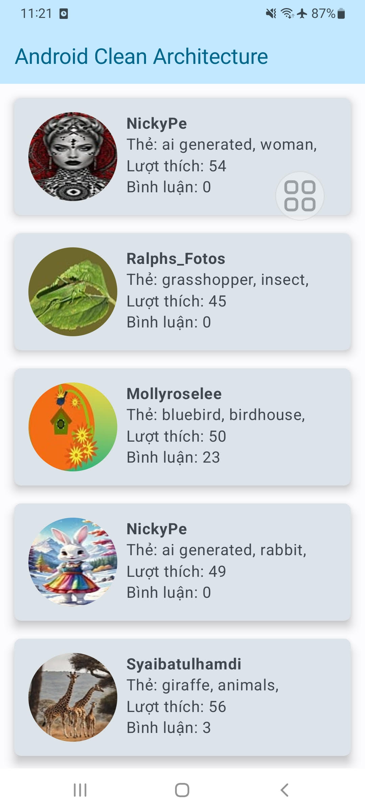

## 🚀 Project using Clean Architecture recommend by Google Developer

This guide encompasses best practices and recommended architecture for building robust, high-quality
apps

- [Guide to app architecture (Gooogle Developers)](https://developer.android.com/topic/architecture?continue=https%3A%2F%2Fdeveloper.android.com%2Fcourses%2Fpathways%2Fandroid-architecture%3Fhl%3Dvi%23article-https%3A%2F%2Fdeveloper.android.com%2Ftopic%2Farchitecture)

## 🚀 Introduction

This sample demonstrates how one can

- Setup base architecture of Android Jetpack Compose app using Clean Architecture
- Use Koin(dependency injection) for layers separation
- Make api calls using Ktor plugin.

```
├── common
├── data
|   ├── config
|   ├── datasources
|   ├── models
|   └── repositories
├── di
├── domain
|   ├── entities
|   ├── repositories
|   └── usecases
├── MainApplication.kt
├── MyActivity.kt
└── ui
    ├── modules
    |   └── photos
    └── theme
```

#### Dependencies
- [Material3](https://mvnrepository.com/artifact/androidx.compose.material3/material3) : Compose Material You Design Components library.
- [Hilt](https://mvnrepository.com/artifact/com.google.dagger.hilt.android/com.google.dagger.hilt.android.gradle.plugin) : A fast dependency
  injector for Android and Java.
- [Retrofit2](https://mvnrepository.com/artifact/com.squareup.retrofit2/retrofit) : A type-safe HTTP client for Android and Java.
- [Coil_Compose](https://mvnrepository.com/artifact/io.coil-kt/coil-compose) : An image loading
  library for Android backed by Kotlin Coroutines.

## 🚀 Module Structure


There are 3 main modules to help separate the code. They are Data, Domain, and Presentaion.

- **Data** contains Local Storage, APIs, Data objects (Request/Response object, DB objects), and the
  repository implementation.

- **Domain** contains UseCases, Domain Objects/Models, and Repository Interfaces

- **Presentaion** contains UI, View Objects, Widgets, etc. Can be split into separate modules itself
  if needed. For example, we could have a module called Device handling things like camera,
  location, etc.

## 🚀 Detail overview

### Repository

- Bridge between Data layer and Domain layer
- Connects to data sources and returns mapped data
- Data sources include DB and Api

#### - DataSource:

```kotlin
interface PhotoRemoteDataSource {
    @GET("?key=${AppConfig.API_KEY}")
    suspend fun getPhoto(): PhotosResponse
}
```

#### - RepositoryImpl:

```kotlin
class PhotoRepositoryImpl @Inject constructor(
    private val remoteDataSource: PhotoRemoteDataSource
) : PhotoRepository {
    override fun getPhoto(): Flow<Resources<List<Hits>>> {
        return flow {
            emit(Resources.Loading(isLoading = true))
            try {
                val response = remoteDataSource.getPhoto()
                emit(Resources.Success(data = response.hits.map { it.toEntity() }))
                emit(Resources.Loading(isLoading = false))
            } catch (e: Exception) {
                emit(Resources.Error("Failed to fetch images"))
                emit(Resources.Loading(isLoading = false))
            }
        }
    }
}
```
### Domain
- Responsible for connecting to repository to retrieve necessary data. returns a Flow<Resources>.
- This is where the business logic takes place.
- Returns data downstream.
- Single use.
- Lives in Domain (No Platform dependencies. Very testable).

#### - UseCase:
```kotlin
class GetPhotoUseCase @Inject constructor(
  private val repository: PhotoRepository
) {
  suspend operator fun invoke(): Flow<Resources<List<Hits>>> {
    return repository.getPhoto()
  }
}
```

### Presentation (Holder of UI)
- Organizes data and holds View state.
- Talks to use cases.

```kotlin
class PhotoViewModel @Inject constructor(private val getPhotoUseCase: GetPhotoUseCase) :
    ViewModel() {
    private val _posts = MutableStateFlow<Resources<List<Hits>>>(Resources.Loading())
    val posts: StateFlow<Resources<List<Hits>>> = _posts

    var state by mutableStateOf(PhotoState())
        private set

    fun onEvent(event: PhotoEvents) {
        when (event) {
            is PhotoEvents.PhotoLoaded -> {
                fetchPosts()
            }
            is PhotoEvents.UpdateText -> {
            }
        }
    }

    init {
        onEvent(PhotoEvents.PhotoLoaded(emptyList()))
    }

    private fun fetchPosts() {
        viewModelScope.launch {
            getPhotoUseCase().collect { resource ->
                _posts.value = resource
                state = when (resource) {
                    is Resources.Loading -> state.copy(isLoading = resource.isLoading)
                    is Resources.Error -> state.copy(isLoading = false)
                    is Resources.Success -> state.copy(
                        hits = resource.data ?: emptyList(),
                        isLoading = false
                    )
                }
            }
        }
    }
}
```

### Presentation (View)
- View,updates UI

```kotlin
fun PhotoListScreen(viewModel: PhotoViewModel) {
    val state = viewModel.state
    val listState = rememberLazyListState() // Remember the scroll state

    Scaffold(topBar = {
        TopAppBar(colors = topAppBarColors(
            containerColor = MaterialTheme.colorScheme.primaryContainer,
            titleContentColor = MaterialTheme.colorScheme.primary,
        ), title = { Text("Android Clean Architecture") })
    }, content = { innerPadding ->
        Column(
            modifier = Modifier.padding(innerPadding),
            verticalArrangement = Arrangement.spacedBy(16.dp),
        ) {
            Box(
                modifier = Modifier
                    .fillMaxSize()
                    .weight(1f),
                contentAlignment = Alignment.Center
            ) {
                when {
                    state.isLoading -> CircularProgressIndicator()
                    state.hits.isEmpty() -> Text(text = "No photo found")
                    state.hits.isNotEmpty() -> {
                        SwipeRefresh(state = SwipeRefreshState(isRefreshing = false),
                            onRefresh = { viewModel.onEvent(PhotoEvents.PhotoLoaded(emptyList())) }) {
                            LazyColumn(
                                state = listState,  // Use the remembered scroll state
                                verticalArrangement = Arrangement.spacedBy(4.dp)
                            ) {
                                items(items = state.hits, key = { it.id }) {
                                    PhotoRow(it)
                                }
                            }
                        }
                    }
                }
            }
        }
    })
}

@Composable
fun PhotoRow(hit: Hits) {
    Card(
        shape = RoundedCornerShape(8.dp), // Set the border radius here
        elevation = CardDefaults.cardElevation(defaultElevation = 8.dp),
        modifier = Modifier
            .padding(
                start = 16.dp, end = 16.dp, top = 16.dp, bottom = 0.dp
            ) // Set left and right margins
            .fillMaxWidth()
            .clickable {},
    ) {
        Row(modifier = Modifier.padding(16.dp)) {
            AsyncImage(
                model = ImageRequest.Builder(LocalContext.current).data(hit.previewURL)
                    .crossfade(true) // Optional crossfade animation
                    .placeholder(R.drawable.placeholder_image) // Default image while loading
                    .error(R.drawable.placeholder_image) // Image if there's an error
                    .size(Size.ORIGINAL) // Optionally specify size to preload at
                    .memoryCachePolicy(CachePolicy.ENABLED) // Enable memory caching
                    .build(),
                contentDescription = "Preview image of ${hit.user}",
                contentScale = ContentScale.FillBounds,
                modifier = Modifier
                    .height(100.dp)
                    .width(100.dp)
                    .clip(RoundedCornerShape(50.dp))
            )
            Column(modifier = Modifier.padding(start = 10.dp)) {
                Text(text = hit.user, fontWeight = FontWeight.Bold)
                Text(text = "Thẻ: ${hit.tags}", maxLines = 1)
                Text(text = "Lượt thích: ${hit.likes}")
                Text(text = "Bình luận: ${hit.comments}")
            }
        }
    }
}
```
## 🚀 Screenshoots

|         Image         |                           |
|:---------------------:|:-------------------------:|
|  |                           | 
