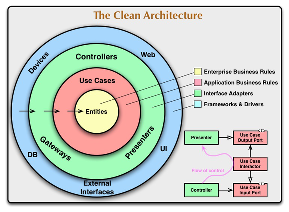
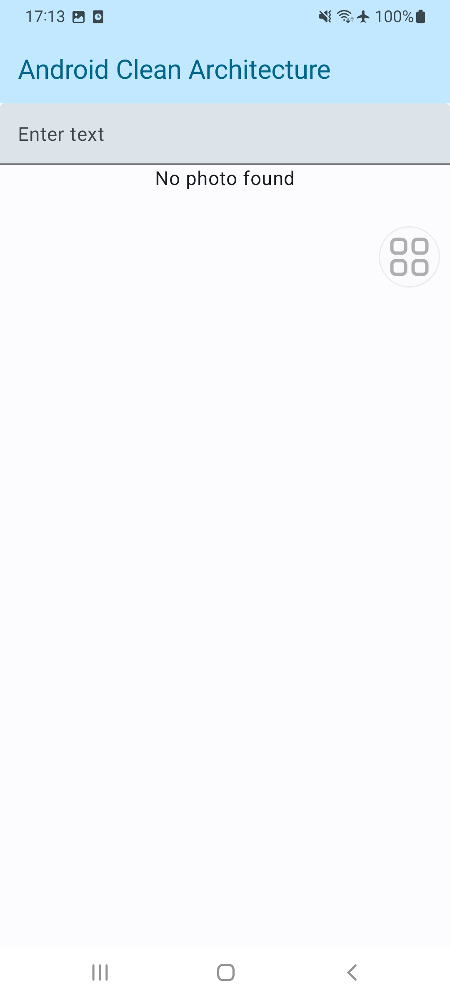
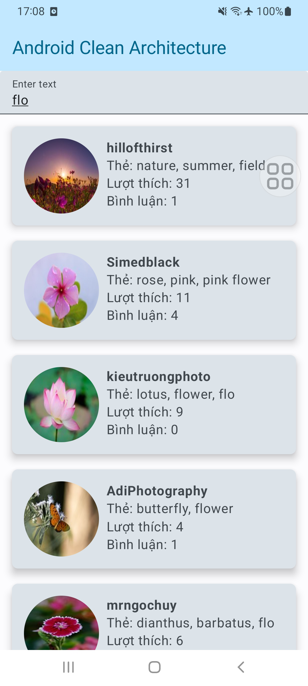

## 🚀 Project using Clean Architecture recommend by Google Developer

This guide encompasses best practices and recommended architecture for building robust, high-quality
apps

- [Guide to app architecture (Gooogle Developers)](https://developer.android.com/topic/architecture?continue=https%3A%2F%2Fdeveloper.android.com%2Fcourses%2Fpathways%2Fandroid-architecture%3Fhl%3Dvi%23article-https%3A%2F%2Fdeveloper.android.com%2Ftopic%2Farchitecture)

## 🚀 Introduction

This sample demonstrates how one can

- Setup base architecture of Android Jetpack Compose app using Clean Architecture
- Use Koin(dependency injection) for layers separation
- Make api calls using Ktor plugin.

```
├── common
├── data
|   ├── config
|   ├── datasources
|   ├── models
|   └── repositories
├── di
├── domain
|   ├── entities
|   ├── repositories
|   └── usecases
├── MainApplication.kt
├── MyActivity.kt
└── ui
    ├── modules
    |   └── photos
    └── theme
```

#### Dependencies
- [Material3](https://mvnrepository.com/artifact/androidx.compose.material3/material3) : Compose Material You Design Components library.
- [Hilt](https://mvnrepository.com/artifact/com.google.dagger.hilt.android/com.google.dagger.hilt.android.gradle.plugin) : A fast dependency
  injector for Android and Java.
- [Retrofit2](https://mvnrepository.com/artifact/com.squareup.retrofit2/retrofit) : A type-safe HTTP client for Android and Java.
- [Coil_Compose](https://mvnrepository.com/artifact/io.coil-kt/coil-compose) : An image loading
  library for Android backed by Kotlin Coroutines.

## 🚀 Module Structure



There are 3 main modules to help separate the code. They are Data, Domain, and Presentaion.

- **Data** contains Local Storage, APIs, Data objects (Request/Response object, DB objects), and the
  repository implementation.

- **Domain** contains UseCases, Domain Objects/Models, and Repository Interfaces

- **Presentaion** contains UI, View Objects, Widgets, etc. Can be split into separate modules itself
  if needed. For example, we could have a module called Device handling things like camera,
  location, etc.

## 🚀 Detail overview

### Repository

- Bridge between Data layer and Domain layer
- Connects to data sources and returns mapped data
- Data sources include DB and Api

#### - DataSource:

```kotlin
interface PhotoRemoteDataSource {
  @GET("?key=${AppConfig.API_KEY}")
  suspend fun getPhotos(
    @Query("q") query: String?,
    @Query("page") page: Int
  ): PhotosResponse
}
```

#### - RepositoryImpl:

```kotlin
class PhotoRepositoryImpl @Inject constructor(
  private val remoteDataSource: PhotoRemoteDataSource
) : PhotoRepository {
  override fun getPhoto(query: String?, page: Int): Flow<Resources<Photos>> {
    return flow {
      try {
        val response = remoteDataSource.getPhotos(query, page)
        emit(Resources.Success(data = response.toEntity()))
      } catch (e: Exception) {
        emit(Resources.Error("Failed to fetch images"))
      }
    }
  }
}
```
### Domain
- Responsible for connecting to repository to retrieve necessary data. returns a Flow<Resources>.
- This is where the business logic takes place.
- Returns data downstream.
- Single use.
- Lives in Domain (No Platform dependencies. Very testable).

#### - UseCase:
```kotlin
class GetPhotoUseCase @Inject constructor(
  private val repository: PhotoRepository
) {
  suspend operator fun invoke(query: String?, page: Int): Flow<Resources<Photos>> {
    return if (query.isNullOrEmpty()) {
      flow {
        emit(Resources.Success(data = null))
      }
    } else {
      repository.getPhoto(query, page)
    }
  }
}
```

### Presentation (Holder of UI)
- Organizes data and holds View state.
- Talks to use cases.

```kotlin
class PhotoViewModel @Inject constructor(private val getPhotoUseCase: GetPhotoUseCase) :
  ViewModel() {
  private val queryFlow = MutableStateFlow("")
  private val refreshTrigger = MutableSharedFlow<Unit>(replay = 1).apply { tryEmit(Unit) }
  private val loadMoreTrigger = MutableSharedFlow<Unit>(replay = 1).apply { tryEmit(Unit) }

  private var currentPage = 1
  private val appendPhotos = mutableListOf<Hits>()

  val state: StateFlow<SearchState?> = combine(
    queryFlow,
    refreshTrigger,
    loadMoreTrigger,
  ) { query, _, _ -> query }
    .debounce(350)
    .flatMapLatest {
      getPhotoUseCase.invoke(it, currentPage).onEach { resource ->
        if (resource is Resources.Success) {
          if (currentPage == 1) {
            appendPhotos.clear()
          }
          val hits = resource.data?.hits ?: emptyList()
          appendPhotos.addAll(hits)
        }
      }
    }
    .map { resource ->
      when (resource) {
        is Resources.Loading -> SearchState.Loading
        is Resources.Success -> SearchState.Success(data = Photos(
          total = resource.data?.total ?: 0,
          totalHits = resource.data?.totalHits ?: 0,
          hits = appendPhotos.toList()
        ))
        is Resources.Error -> SearchState.Error(resource.message.toString())
      }
    }
    .stateIn(viewModelScope, SharingStarted.Lazily, SearchState.Idle)

  fun onIntent(event: PhotoIntent) {
    when (event) {
      is PhotoIntent.SearchPhotosWithoutQuery -> queryFlow.value = ""
      is PhotoIntent.SearchPhotos -> {
        currentPage = 1
        queryFlow.value = event.q
      }
      is PhotoIntent.RefreshPhotos -> {
        currentPage = 1
        refreshTrigger.tryEmit(Unit)
      }
      is PhotoIntent.LoadMorePhotos -> {
        currentPage += 1
        loadMoreTrigger.tryEmit(Unit)
      }
    }
  }

  init {
    onIntent(PhotoIntent.SearchPhotosWithoutQuery)
  }
}
```

### Presentation (View)
- View,updates UI

```kotlin
fun PhotoListScreen(viewModel: PhotoViewModel = hiltViewModel()) {
  val state = viewModel.state.collectAsState()
  val listState = rememberLazyListState() // Remember the scroll state

  var query by remember { mutableStateOf("") }
  val focusManager = LocalFocusManager.current

  Scaffold(topBar = {
    TopAppBar(colors = topAppBarColors(
      containerColor = MaterialTheme.colorScheme.primaryContainer,
      titleContentColor = MaterialTheme.colorScheme.primary,
    ), title = { Text("Android Clean Architecture") })
  }, content = { innerPadding ->
    Column(
      modifier = Modifier
        .fillMaxSize()
        .padding(innerPadding),
      horizontalAlignment = Alignment.CenterHorizontally, // Horizontally centers children
    ) {
      TextField(
        value = query,
        onValueChange = {
          query = it
          viewModel.onIntent(PhotoIntent.SearchPhotos(it, 1))
        },
        label = { Text("Enter text") },
        placeholder = { Text("Type something...") },
        modifier = Modifier.fillMaxWidth(),
        keyboardOptions = KeyboardOptions.Default.copy(
          keyboardType = KeyboardType.Text,
          imeAction = ImeAction.Done
        ),
        keyboardActions = KeyboardActions(
          onDone = {
            focusManager.clearFocus()
          }
        ),
      )

      Spacer(modifier = Modifier.height(0.dp))

      when (state.value) {
        is SearchState.Loading -> CircularProgressIndicator()
        is SearchState.Success -> {
          val hits = (state.value as SearchState.Success).data.hits
          println("PhotoListScreen_value: ${(state.value as SearchState.Success).data.totalHits} - ${hits.size}")
          if (hits.isNullOrEmpty()) {
            Text(text = "No photo found")
          } else {
            focusManager.clearFocus()
            SwipeRefresh(state = SwipeRefreshState(isRefreshing = false),
              onRefresh = { viewModel.onIntent(PhotoIntent.RefreshPhotos(query)) }) {
              LazyColumn(
                state = listState,  // Use the remembered scroll state
                verticalArrangement = Arrangement.spacedBy(4.dp)
              ) {
                items(items = hits, key = { it.id }) {
                  PhotoRow(it)
                }
                if (hits.size < (state.value as SearchState.Success).data.totalHits) {
                  item {
                    LaunchedEffect(Unit) {
                      viewModel.onIntent(PhotoIntent.LoadMorePhotos(query))
                    }
                    CircularProgressIndicator(
                      modifier = Modifier
                        .fillMaxWidth()
                        .padding(16.dp)
                        .wrapContentWidth(Alignment.CenterHorizontally)
                    )
                  }
                }
              }
            }
          }
        }

        is SearchState.Error -> Text(text = "Error")
        is SearchState.Idle -> Text(text = "Idle")
        else -> Text(text = "null")
      }
    }
  })
}

@Composable
fun PhotoRow(hit: Hits) {
  Card(
    shape = RoundedCornerShape(8.dp), // Set the border radius here
    elevation = CardDefaults.cardElevation(defaultElevation = 8.dp),
    modifier = Modifier
      .padding(
        start = 16.dp, end = 16.dp, top = 16.dp, bottom = 0.dp
      ) // Set left and right margins
      .fillMaxWidth()
      .clickable {},
  ) {
    Row(modifier = Modifier.padding(16.dp)) {
      AsyncImage(
        model = ImageRequest.Builder(LocalContext.current).data(hit.previewURL)
          .crossfade(true) // Optional crossfade animation
          .placeholder(R.drawable.placeholder_image) // Default image while loading
          .error(R.drawable.placeholder_image) // Image if there's an error
          .size(Size.ORIGINAL) // Optionally specify size to preload at
          .memoryCachePolicy(CachePolicy.ENABLED) // Enable memory caching
          .build(),
        contentDescription = "Preview image of ${hit.user}",
        contentScale = ContentScale.FillBounds,
        modifier = Modifier
          .height(100.dp)
          .width(100.dp)
          .clip(RoundedCornerShape(50.dp))
      )
      Column(modifier = Modifier.padding(start = 10.dp)) {
        Text(text = hit.user, fontWeight = FontWeight.Bold)
        Text(text = "Thẻ: ${hit.tags}", maxLines = 1)
        Text(text = "Lượt thích: ${hit.likes}")
        Text(text = "Bình luận: ${hit.comments}")
      }
    }
  }
}
```
## 🚀 Screenshoots

|    Default Search    | Search keyword (ex: flo) |
|:--------------------:|:------------------------:|
|  |      |
